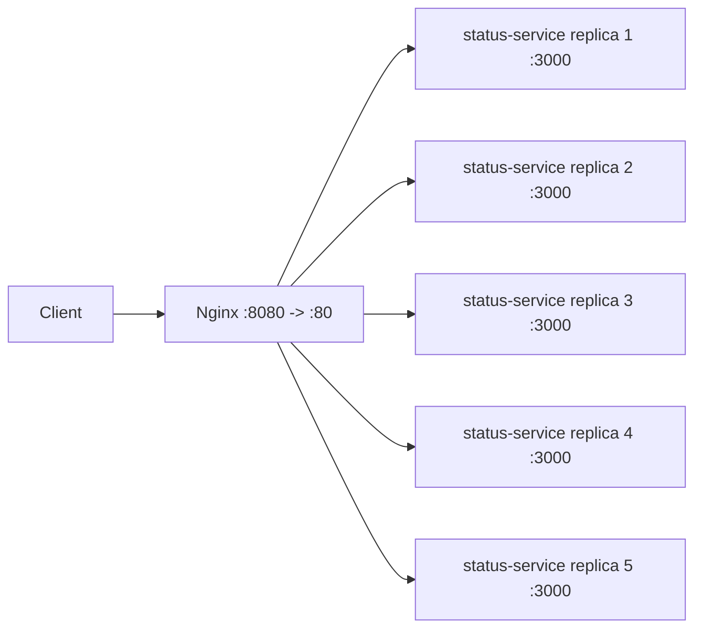

# Status Service Load Balancing

## 1. Mo ta

Bai nay dung mot status service stateless bang TypeScript + Express, dat sau Nginx load balancer. Moi replica tra ve hostname rieng qua field `servedBy`, vi trong Docker `os.hostname()` la container ID nen co the dung lam fingerprint de quan sat phan tai.

Service lang nghe cong noi bo `3000` va cung cap 3 endpoint:

- `GET /api/status`: tra `{status, servedBy, timestamp}`
- `GET /api/heavy?load=`: tao CPU work co gioi han de test request nang
- `GET /api/metrics`: tra metric rieng cua tung instance `{servedBy, requestCount, uptimeSeconds, timestamp}`

## 2. Cach chay

Chay local:

```bash
npm install
npm run start:dev
curl http://localhost:3000/api/status
```

Build va chay compiled JavaScript tu TypeScript:

```bash
npm run build
npm start
```

Chay bang Docker Compose va scale 5 replica:

```bash
docker compose up -d --build --scale status-service=5
curl http://localhost:8080/api/status
./scripts/prove-round-robin.ps1
```

Dung cum:

```bash
docker compose down
```

## 3. Kien truc / stack



Stack:

- Node.js 20 + TypeScript + Express
- Docker multi-stage image
- Docker Compose scale
- Nginx `1.27-alpine`
- Docker embedded DNS resolver `127.0.0.11`

## 4. Smoke test

Local contract test:

```text
{"status":"ok","servedBy":"BETUANMINH","timestamp":"2026-07-02T10:34:21.310Z"}
{"status":"ok","servedBy":"BETUANMINH","load":1000,"checksum":496599,"durationMs":0.064,"timestamp":"2026-07-02T10:34:21.367Z"}
{"servedBy":"BETUANMINH","requestCount":3,"uptimeSeconds":2.095,"timestamp":"2026-07-02T10:34:21.371Z"}
```

Docker Compose sau khi scale 5 replica:

```text
[compose] 6 services:
  sys-desgin-foundation-1-nginx-1 (nginx:1.27-alpine) Up 7 seconds [8080, 8080]
  sys-desgin-foundation-1-status-service-1 (sys-desgin-foundation-1-status-service) Up 14 seconds (healthy) [3000/tcp]
  sys-desgin-foundation-1-status-service-2 (sys-desgin-foundation-1-status-service) Up 15 seconds (healthy) [3000/tcp]
  sys-desgin-foundation-1-status-service-3 (sys-desgin-foundation-1-status-service) Up 13 seconds (healthy) [3000/tcp]
  sys-desgin-foundation-1-status-service-4 (sys-desgin-foundation-1-status-service) Up 14 seconds (healthy) [3000/tcp]
  sys-desgin-foundation-1-status-service-5 (sys-desgin-foundation-1-status-service) Up 13 seconds (healthy) [3000/tcp]
```

Goi `/api/status` qua Nginx:

```text
1: 3bd708dcac72
2: 9c559bce3d2d
3: a95457556f2d
4: df1fd865ea6f
5: 9f074d8d639f
6: 3bd708dcac72
7: 9c559bce3d2d
8: a95457556f2d
9: df1fd865ea6f
10: 9f074d8d639f
11: 3bd708dcac72
12: 9c559bce3d2d
13: a95457556f2d
14: df1fd865ea6f
15: 9f074d8d639f
```

Script `./scripts/prove-round-robin.ps1` cung verify tu dong:

```text
Round-robin proof passed: 5 unique nodes, same order repeated 3 times.
```

Goi `/api/metrics` qua Nginx:

```text
1: 3bd708dcac72 requestCount=6 uptimeSeconds=22.135
2: 9c559bce3d2d requestCount=6 uptimeSeconds=22.937
3: a95457556f2d requestCount=6 uptimeSeconds=23.269
4: df1fd865ea6f requestCount=6 uptimeSeconds=23.71
5: 9f074d8d639f requestCount=6 uptimeSeconds=22.629
6: 3bd708dcac72 requestCount=7 uptimeSeconds=22.285
7: 9c559bce3d2d requestCount=7 uptimeSeconds=22.975
8: a95457556f2d requestCount=7 uptimeSeconds=23.304
9: df1fd865ea6f requestCount=7 uptimeSeconds=23.743
10: 9f074d8d639f requestCount=7 uptimeSeconds=22.66
```

## 5. Giai thich phan tai

Nginx la entrypoint duy nhat tren host port `8080`. Request duoc proxy xuong `status-service:3000`.

Config Nginx dung:

```nginx
resolver 127.0.0.11 valid=1s ipv6=off;
upstream status_backend {
  zone status_backend 64k;
  server status-service:3000 resolve;
}

set $backend "status_backend";
proxy_pass http://$backend;
```

`127.0.0.11` la Docker embedded DNS. Khi `status-service` duoc scale bang Compose, DNS name `status-service` tra ve nhieu dia chi container. `upstream status_backend` dung `server status-service:3000 resolve` de Nginx lay danh sach backend tu Docker DNS, roi Nginx thuc hien round-robin tren upstream group. `proxy_pass http://$backend` van dung bien `$backend` theo yeu cau bai.

Output `/api/status` cho thay vong round-robin ro rang qua 5 node va lap lai dung thu tu 3 lan: `3bd708dcac72 -> 9c559bce3d2d -> a95457556f2d -> df1fd865ea6f -> 9f074d8d639f`.

Metrics cung xac nhan counter nam trong tung process rieng: cung mot endpoint `/api/metrics`, nhung moi hostname co `requestCount` rieng va tang doc lap.

## 6. Design decisions

- Service stateless: khong ghi file, DB, session store hay shared memory.
- `servedBy = os.hostname()` de Docker container ID tro thanh instance fingerprint.
- Source viet bang TypeScript trong `src/index.ts`, production build ra `dist/index.js`.
- `requestCount` la bien trong process. Node.js xu ly JavaScript tren mot event loop, nen phep tang counter nay an toan trong pham vi mot instance va khong chia se giua replica.
- Dockerfile multi-stage chay `npm run build`, prune dev dependencies, va image runtime chi gom production dependencies + `dist`.
- Compose chi expose port `3000` trong network noi bo; host chi truy cap qua Nginx port `8080`.
- Healthcheck dung `/api/status` de Nginx chi start sau khi cac replica healthy.
