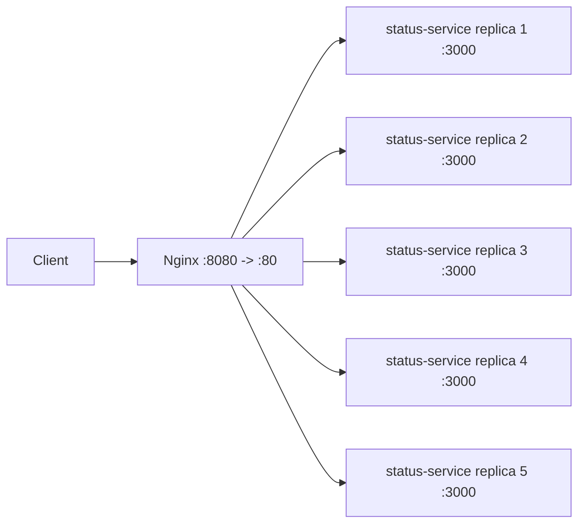

# Status Service Load Balancing

## 1. Mo ta

Bai nay dung mot status service stateless bang Express, dat sau Nginx load balancer. Moi replica tra ve hostname rieng qua field `servedBy`, vi trong Docker `os.hostname()` la container ID nen co the dung lam fingerprint de quan sat phan tai.

Service lang nghe cong noi bo `3000` va cung cap 3 endpoint:

- `GET /api/status`: tra `{status, servedBy, timestamp}`
- `GET /api/heavy?load=`: tao CPU work co gioi han de test request nang
- `GET /api/metrics`: tra metric rieng cua tung instance `{servedBy, requestCount, uptimeSeconds, timestamp}`

## 2. Cach chay

Chay local:

```bash
npm install
npm run start:dev
curl http://localhost:3000/api/status
```

Chay bang Docker Compose va scale 5 replica:

```bash
docker compose up -d --build --scale status-service=5
curl http://localhost:8080/api/status
```

Dung cum:

```bash
docker compose down
```

## 3. Kien truc / stack



Stack:

- Node.js 20 + Express
- Docker multi-stage image
- Docker Compose scale
- Nginx `1.27-alpine`
- Docker embedded DNS resolver `127.0.0.11`

## 4. Smoke test

Local contract test:

```text
{"status":"ok","servedBy":"BETUANMINH","timestamp":"2026-07-02T09:47:56.807Z"}
{"status":"ok","servedBy":"BETUANMINH","load":1000,"checksum":496599,"durationMs":0.086,"timestamp":"2026-07-02T09:47:56.897Z"}
{"servedBy":"BETUANMINH","requestCount":3,"uptimeSeconds":3.167,"timestamp":"2026-07-02T09:47:56.903Z"}
```

Docker Compose sau khi scale 5 replica:

```text
[compose] 6 services:
  systemdesign-nginx-1 (nginx:1.27-alpine) Up 13 seconds [8080, 8080]
  systemdesign-status-service-1 (systemdesign-status-service) Up 19 seconds (healthy) [3000/tcp]
  systemdesign-status-service-2 (systemdesign-status-service) Up 19 seconds (healthy) [3000/tcp]
  systemdesign-status-service-3 (systemdesign-status-service) Up 19 seconds (healthy) [3000/tcp]
  systemdesign-status-service-4 (systemdesign-status-service) Up 19 seconds (healthy) [3000/tcp]
  systemdesign-status-service-5 (systemdesign-status-service) Up 18 seconds (healthy) [3000/tcp]
```

Goi `/api/status` qua Nginx:

```text
1: 32b3e08cf570
2: d27b68be36b8
3: d27b68be36b8
4: ff25331fba41
5: ff25331fba41
6: 32b3e08cf570
7: c57acb459d15
8: c57acb459d15
9: d27b68be36b8
10: c57acb459d15
11: 08c2c7426f08
12: 32b3e08cf570
13: 08c2c7426f08
14: 32b3e08cf570
15: 32b3e08cf570
16: c57acb459d15
17: 08c2c7426f08
18: 32b3e08cf570
19: ff25331fba41
20: ff25331fba41
```

Goi `/api/metrics` qua Nginx:

```text
1: 32b3e08cf570 requestCount=13 uptimeSeconds=31.12
2: d27b68be36b8 requestCount=9 uptimeSeconds=31.542
3: 32b3e08cf570 requestCount=14 uptimeSeconds=31.425
4: 08c2c7426f08 requestCount=10 uptimeSeconds=32.059
5: 08c2c7426f08 requestCount=11 uptimeSeconds=32.184
6: 08c2c7426f08 requestCount=12 uptimeSeconds=32.323
7: c57acb459d15 requestCount=8 uptimeSeconds=31.491
8: 08c2c7426f08 requestCount=13 uptimeSeconds=32.588
9: 32b3e08cf570 requestCount=15 uptimeSeconds=32.219
10: 08c2c7426f08 requestCount=14 uptimeSeconds=32.855
11: ff25331fba41 requestCount=10 uptimeSeconds=32.261
12: ff25331fba41 requestCount=11 uptimeSeconds=32.4
```

## 5. Giai thich phan tai

Nginx la entrypoint duy nhat tren host port `8080`. Request duoc proxy xuong `status-service:3000`.

Config Nginx dung:

```nginx
resolver 127.0.0.11 valid=1s ipv6=off;
set $backend "status-service:3000";
proxy_pass http://$backend;
```

`127.0.0.11` la Docker embedded DNS. Khi `status-service` duoc scale bang Compose, DNS name `status-service` tra ve nhieu dia chi container. Dung bien `$backend` lam Nginx resolve lai ten service theo resolver thay vi giu ket qua DNS dau tien qua lau. Output `/api/status` cho thay request di qua 5 `servedBy` khac nhau: `32b3e08cf570`, `d27b68be36b8`, `ff25331fba41`, `c57acb459d15`, `08c2c7426f08`.

Metrics cung xac nhan counter nam trong tung process rieng: cung mot endpoint `/api/metrics`, nhung moi hostname co `requestCount` rieng va tang doc lap.

## 6. Design decisions

- Service stateless: khong ghi file, DB, session store hay shared memory.
- `servedBy = os.hostname()` de Docker container ID tro thanh instance fingerprint.
- `requestCount` la bien trong process. Node.js xu ly JavaScript tren mot event loop, nen phep tang counter nay an toan trong pham vi mot instance va khong chia se giua replica.
- Dockerfile multi-stage de image runtime chi gom production dependencies va source can chay.
- Compose chi expose port `3000` trong network noi bo; host chi truy cap qua Nginx port `8080`.
- Healthcheck dung `/api/status` de Nginx chi start sau khi cac replica healthy.
